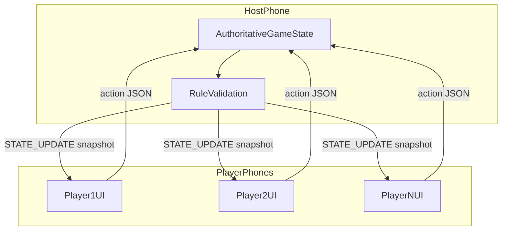

# Architecture

Backseat Games uses a **host-authoritative** model: one device owns game state and validates every action before broadcasting updates to all players.

## System overview



## Session lifecycle

1. **Home** — host picks a game type and name, or joiners browse nearby sessions.
2. **Waiting room** — joiners enter display names; host sees roster and taps **Start Game**.
3. **In-game** — players send actions; host validates via `applyAction()` and broadcasts full state snapshots.
4. **Finished** — bingo or sign game sets `winnerId` and `phase: 'finished'`; UI shows celebration.

## Multiplayer layer

### `MultiplayerService` interface

Located in [`src/multiplayer/types.ts`](../src/multiplayer/types.ts). Implementations:

| Implementation | When used |
|----------------|-----------|
| `MockMultiplayerService` | Expo Go, simulators, single-device dev |
| `MultipeerService` (native bridge) | Optional iOS nearby discovery / join |
| `RelayMultiplayerService` | Join-code sessions via SignalR relay |
| `HybridMultiplayerService` | Production — relay + optional iOS Multipeer |

The factory [`getMultiplayerService()`](../src/multiplayer/index.ts) returns `HybridMultiplayerService` in dev/production builds.

### Relay server

ASP.NET Core SignalR app in [`server/BackseatGames.Relay/`](../server/BackseatGames.Relay/). Deploy to Azure Container Apps; set `EXPO_PUBLIC_RELAY_URL` to the HTTPS base URL.

| Endpoint | Purpose |
|----------|---------|
| `POST /rooms` | Host creates ephemeral room → `{ joinCode, sessionId }` |
| `GET /rooms/{code}` | Joiner validates code |
| SignalR `/game` | `JoinRoom`, `RouteMessage` — dumb JSON router |

Rooms expire after **4 hours** of inactivity. Game logic stays on the host phone.

### Host vs joiner

| Role | Responsibilities |
|------|------------------|
| **Host** | Advertises session, owns `SessionState`, runs rule engine, broadcasts updates |
| **Joiner** | Browses sessions, sends `JOIN`, dispatches `ACTION` messages, renders from snapshots |

### Message protocol

| Message | Direction | Payload |
|---------|-----------|---------|
| `JOIN` | Joiner → Host | `{ name }` |
| `WELCOME` | Host → Joiner | `{ playerId, state }` |
| `PLAYER_JOINED` | Host → All | `{ player, state }` |
| `START_GAME` | Host → All | `{ gameType, state }` |
| `ACTION` | Joiner → Host | `{ playerId, action }` |
| `STATE_UPDATE` | Host → All | `{ state }` |
| `ACTION_REJECTED` | Host → Player | `{ playerId, reason }` |

Game actions:

- `CLAIM_PLATE` / `UNCLAIM_PLATE` — `{ plateCode }`
- `MARK_BINGO` / `UNMARK_BINGO` — `{ index }` (0–24)
- `SUBMIT_SIGN_WORD` — `{ letter, word, audioUri? }`

### State sync strategy

MVP uses **full snapshot** broadcast on every valid action. Payloads are small (≤6 players, compact JSON) — patches can be added later if needed.

### iOS permissions

Configured in [`app.json`](../app.json):

- `NSLocalNetworkUsageDescription` — Multipeer / Bonjour
- `NSBonjourServices` — `_backseatgames._tcp`
- `NSMicrophoneUsageDescription` — Sign Game recording

### Car reliability

- **Join code (relay)** — primary path; needs internet on each phone, not a shared hotspot.
- **Foreground-only** — iOS throttles local networking in background.
- **Nearby Multipeer (iOS)** — optional when phones share Wi‑Fi or Personal Hotspot.
- **Persistent session** — one connection per trip; avoid reconnecting per action.

## Rule engine

Central module: [`src/games/ruleEngine.ts`](../src/games/ruleEngine.ts)

```typescript
applyAction(session, playerId, action) =>
  { ok: true, state } | { ok: false, reason: string }
```

Per-game modules:

| Module | File |
|--------|------|
| License Plates | [`licensePlates.ts`](../src/games/licensePlates.ts) |
| Travel Bingo | [`bingo.ts`](../src/games/bingo.ts) |
| Sign Game | [`signGame.ts`](../src/games/signGame.ts) |

Each exports `create*State()` and `apply*Action()`. Host-only validation — joiners never mutate state locally except for optimistic UI (not used in MVP).

### Sign Game letter rules

- **A–P, R–Y** — word must **start with** the letter.
- **Q, X, Z** — letter must **appear anywhere** (house rule).
- Global **used-word set** — normalized lowercase, trimmed.

## State model

See [`src/types/game.ts`](../src/types/game.ts) for `SessionState`, `GameState`, and action types.

## Navigation (expo-router)

| Route | Screen |
|-------|--------|
| `/` | Home |
| `/host/setup` | Host picks game + name |
| `/join` | Browse & join sessions |
| `/lobby/[sessionId]` | Waiting room |
| `/game/license-plates` | License plate grid |
| `/game/bingo` | Bingo card |
| `/game/sign-game` | Sign game |

## Audio (Sign Game)

- Record locally with **expo-audio** (`useSignGameAudio` hook).
- Sync **word + letter + playerId** over the network — not raw audio bytes (keeps P2P payload small).
- Playback uses local `audioUri` on the submitting device.

## Folder layout

```
app/                     Route screens
src/components/          Reusable UI
src/data/                Static JSON pools
src/games/               Rule engine + tests
src/hooks/               Audio hook
src/multiplayer/         P2P adapters
src/store/               Zustand session store
src/theme/               Design tokens
src/types/               Shared types
```

## Build & deploy (Windows → TestFlight)

### Recommended: GitHub Actions (no EAS cloud quota)

Workflow: [`.github/workflows/ios-testflight.yml`](../.github/workflows/ios-testflight.yml)

- Runs on **`macos-26`** (Xcode 26+ required for TestFlight upload).
- **`eas build --local`** on the runner — does not consume Expo cloud build credits.
- Upload via App Store Connect API (`xcrun altool`).
- Signing secrets in GitHub **`testflight`** environment.

Setup: [TESTFLIGHT_CI.md](./TESTFLIGHT_CI.md). Reuse six Apple secrets from Homol Invests; create a new provisioning profile for `com.homolworks.backseatgames`.

Build numbers: GitHub `run_number` → `IOS_BUILD_NUMBER` → [`app.config.js`](../app.config.js).

### Optional: EAS cloud (uses monthly quota)

```bash
eas build --profile production --platform ios
eas submit --platform ios
```

### Local dev

Expo Go on iPhone for UI iteration — no Mac or cloud build required.

## Design decisions

| Decision | Rationale |
|----------|-----------|
| Expo + TypeScript | Fast Windows → iPhone loop via Expo Go |
| Host-authoritative | Simple rule enforcement without conflict resolution |
| No backend rule engine | Host phone stays authoritative; relay only routes messages |
| Hybrid multiplayer | Join codes work everywhere; Multipeer when LAN allows |
| Mock multiplayer in Expo Go | UI/rules dev without native build |
| Full state snapshots | Simplicity over bandwidth optimization at family scale |

## Push notifications (planned)

Native builds include the **Push Notifications** entitlement (`expo-notifications` plugin). Runtime sending/handling is not implemented yet — see [PUSH_SETUP.md](./PUSH_SETUP.md).

Enable **Push Notifications** on App ID `com.homolworks.backseatgames` before creating the provisioning profile.

## Future extension points

- Push alerts (host started game, join reminders)
- Android via relay join codes (Multipeer iOS optional)
- Host migration if host phone dies
- Relay sign-game audio to all players
- Patch-based state sync
- Optional `react-native-multipeer-connectivity` config plugin for production
